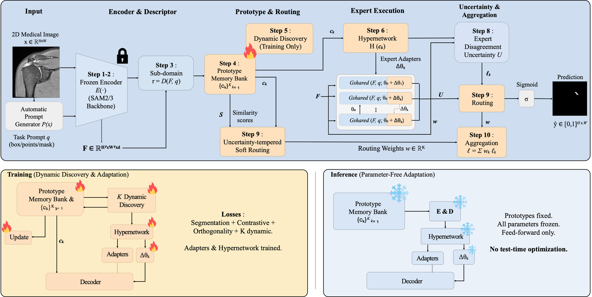
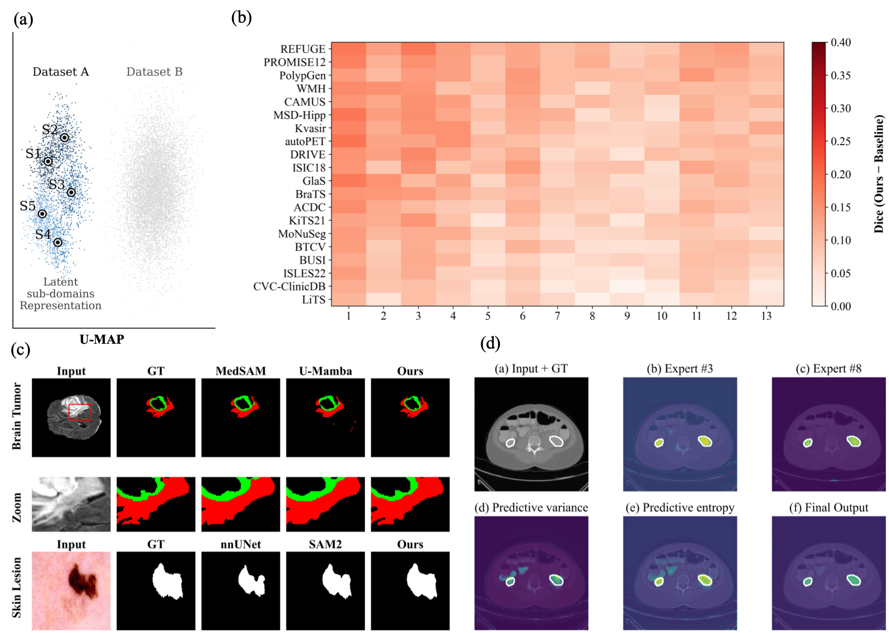
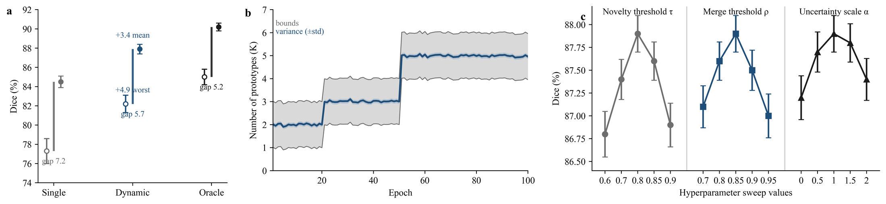

# LSD-Seg: Latent Sub-domain Segmentation

A prototype-conditioned medical image segmentation framework for heterogeneous datasets with hidden sub-domains, interpretable expert routing, and uncertainty-aware prediction.

[]()
[]()
[]()
[]()

<p align="center">
  
</p>
<p align="center">
  <em>Overview of LSD-Seg: dynamic latent prototypes, prototype-conditioned FiLM experts, and uncertainty-tempered routing for robust medical segmentation.</em>
</p>

LSD-Seg is designed for the realistic case where a "single dataset" actually contains multiple latent acquisition styles, clinical centers, scanners, or annotation regimes. Instead of fitting one universal segmentation function, the model maintains a dynamic prototype memory, generates prototype-conditioned FiLM experts, and mixes expert predictions with uncertainty-tempered routing.

The repository is structured as a paper companion codebase rather than a minimal script dump. It includes a lightweight ResNet fallback path for smoke tests and debugging, plus a paper-aligned SAM2 path when the official SAM2 dependency, config, and checkpoint are installed.

## Highlights

- Dynamic latent prototype memory for hidden sub-domains.
- Prototype-conditioned FiLM expert decoder with shared backbone features.
- Uncertainty-tempered routing for ambiguous boundaries and heterogeneous samples.
- `resnet`, `sam`, and `sam2` encoder modes under a shared downstream pipeline.
- Optional native SAM/SAM2 mask prior with explicit fallback tracking.
- Evaluation with Dice, IoU, HD95, ASSD, Boundary-F1, ECE, worst-subdomain Dice, runtime, and memory.
- Analysis utilities for win/loss heatmaps, latent projections, qualitative grids, prototype evolution, and routing uncertainty.

## News / Status

| Component | Status |
| --- | --- |
| ResNet fallback | Implemented |
| SAM1 encoder | Optional |
| SAM2 encoder | Implemented with official SAM2 dependency |
| Native SAM/SAM2 mask prior | Optional, with fallback tracking |
| Dynamic prototypes | Implemented |
| Hypernetwork FiLM experts | Implemented |
| Uncertainty routing | Implemented |
| Training / evaluation | Implemented |
| External baselines | Wrapper-oriented / non-vendored |

## 🧠 Method Overview

```text
x
 ├─> Frozen encoder E
 ├─> Prompt generator
 ├─> Descriptor r
 ├─> Dynamic prototype memory {c_k}
 ├─> Router w_k = softmax(sim(r, c_k) / tau)
 ├─> Hypernetwork H(c_k) -> FiLM parameters
 ├─> Expert decoder p_k
 └─> Uncertainty-tempered mixture -> final mask
```

LSD-Seg models hidden intra-domain heterogeneity explicitly. Each sample is summarized by a prompt-conditioned descriptor, assigned against a dynamic prototype bank, and routed toward prototype-conditioned experts. The segmentation decoder is shared, but each expert receives prototype-specific FiLM modulation generated by a hypernetwork.

For SAM/SAM2-backed experiments, the encoder can provide stronger frozen image features and optionally a native mask prior. That prior is not assumed to work universally: if native prompt/mask decoding fails and fallback is enabled, the system falls back to the coarse prompt-generator prior and logs that event for analysis.

The design target is not only higher average Dice, but also stronger robustness under hidden sub-domain shift, better boundary behavior, and more interpretable routing/uncertainty analysis.

<p align="center">
  
</p>
<p align="center">
  <em>Main result summary: latent sub-domain discovery, cross-dataset win/loss analysis, qualitative segmentation, and routing/uncertainty visualization.</em>
</p>

## Encoder Modes

| `encoder_type` | Purpose | Dependency | Recommended use |
| --- | --- | --- | --- |
| `resnet` | Lightweight fallback | `torchvision` | Smoke tests and debugging |
| `sam` | SAM1-backed optional path | `segment-anything` | Optional baseline or ablation |
| `sam2` | Paper-aligned path | Official `sam2` | Main experiments |

The downstream dynamic prototype memory, router, hypernetwork, FiLM decoder, and uncertainty-tempered mixture are shared across encoder modes.

## Decoder Modes

| `decoder_type` | Meaning | Use |
| --- | --- | --- |
| `film` | FiLM expert decoder only | Fallback and debugging |
| `hybrid` | FiLM expert decoder + optional SAM/SAM2 prior | Main LSD-Seg |
| `sam_mask` | Native SAM/SAM2 mask-decoder baseline | Sanity check only |

`decoder_type: sam_mask` bypasses prototype-conditioned expert diversity and should not be used as the main LSD-Seg method.

## Installation

```bash
git clone https://github.com/Macs-Laboratory/lsd-seg.git
cd lsd-seg
uv sync
```

Depending on your environment, you can also install the package in editable mode:

```bash
pip install -e .
```

The project currently targets Python 3.10+ and PyTorch 2.x.

## 🚀 Quick Start: ResNet Fallback

```bash
uv run python scripts/smoke_test.py
uv run python scripts/train.py --config configs/default.yaml --experiment ours_full
uv run python scripts/evaluate.py --config configs/default.yaml --experiment ours_full
```

This path is intended to verify that the codebase runs without SAM/SAM2 dependencies. It is the recommended first step before enabling heavier paper-aligned configurations.

## SAM2 Paper-Aligned Setup

The main paper-aligned configuration is:

```yaml
model:
  encoder_type: sam2
  decoder_type: hybrid
  use_sam_mask_prior: true
```

### 1. Install SAM2

```bash
# Install the official SAM2 package following the upstream instructions.
# Make sure `import sam2` works in this environment.
```

### 2. Inspect SAM2 features

```bash
uv run python scripts/inspect_sam2_features.py \
  --model-cfg /path/to/sam2_hiera_l.yaml \
  --checkpoint /path/to/sam2_hiera_large.pt \
  --image-size 1024
```

### 3. Test native SAM2 mask prior

```bash
uv run python scripts/inspect_sam2_features.py \
  --model-cfg /path/to/sam2_hiera_l.yaml \
  --checkpoint /path/to/sam2_hiera_large.pt \
  --image-size 1024 \
  --feature-key backbone_fpn \
  --out-indices 0,1,2,3 \
  --feature-channels 256,256,256,256 \
  --test-mask-decoder \
  --mask-input-size 256
```

Notes:

- If the script reports a channel mismatch, copy the reported channel list into [`configs/sam2.example.yaml`](configs/sam2.example.yaml).
- If your SAM2 build exposes a different branch, re-run with `--feature-key ...` and adjust `sam2_feature_key`.
- If native mask decoding fails but fallback is enabled, the model uses `prompt_prior_logits` as `decoder_prior_logits`.
- Evaluation logs `sam_native_prior_used_rate` and `sam_decoder_fallback_rate`, so fallback usage is measurable rather than silent.

### 4. Train the SAM2 hybrid path

```bash
uv run python scripts/train.py \
  --config configs/sam2.example.yaml \
  --experiment ours_full
```

## Data Format

The data pipeline is manifest-driven.

Example record:

```json
{
  "image": "path/to/image.png",
  "mask": "path/to/mask.png",
  "sample_id": "case001_slice000",
  "subdomain_id": "center_a"
}
```

Practical notes:

- Binary masks are the default setting.
- 3D datasets should be converted or indexed slice-wise for the current 2D training path.
- Patient-level splits should be used to avoid leakage across train/val/test.
- Public dataset links are kept in [`configs/public_datasets.yaml`](configs/public_datasets.yaml); raw datasets are not vendored in this repository.

## Training

```bash
uv run python scripts/train.py \
  --config configs/default.yaml \
  --experiment ours_full
```

Training saves the usual experiment artifacts, including:

- `best_model.pt`
- merged run config
- prototype summary
- tracked scalar metrics

Prototype creation, update, and merge happen inside the model forward pass under non-gradient logic. Evaluation never mutates the prototype memory.

## 📊 Evaluation

```bash
uv run python scripts/evaluate.py \
  --config configs/default.yaml \
  --experiment ours_full
```

The evaluator reports:

- Dice
- IoU
- HD95
- ASSD
- Boundary-F1
- ECE
- worst-subdomain Dice
- inter-subdomain variance
- runtime
- memory

Expected outputs:

- `per_sample_metrics.csv`
- `summary_metrics.csv`
- `sample_artifacts/*.npz` when `evaluation.save_predictions=true`

## Reviewer-facing Supplementary Analyses

The MICCAI paper is page-limited, so the repository includes additional analyses requested during review. These analyses are not required to run the model, but are useful for verifying robustness claims.

Some reviewer-facing scripts are aggregators or template generators. They do not fabricate missing results. If raw evaluation CSVs are not available, they create NA templates that must be filled by running the corresponding experiments.

| Concern | Document / Script | Input required |
| --- | --- | --- |
| Reviewer-response companion index | [`docs/reviewer_addendum.md`](docs/reviewer_addendum.md) | None |
| Paper-reported aggregate values | [`docs/extended_results.md`](docs/extended_results.md), [`scripts/make_reviewer_tables.py`](scripts/make_reviewer_tables.py) | Optional `results/per_dataset_results.csv` for per-dataset tables |
| Per-dataset breakdown and Wilcoxon tests | [`docs/statistical_testing.md`](docs/statistical_testing.md), [`scripts/compute_statistical_tests.py`](scripts/compute_statistical_tests.py) | `results/per_dataset_results.csv` |
| Runtime and peak memory | [`docs/runtime_memory.md`](docs/runtime_memory.md), [`scripts/summarize_runtime_memory.py`](scripts/summarize_runtime_memory.py) | Evaluator CSVs with `runtime_seconds`, `peak_gpu_memory_mb` |
| Prompt sensitivity | [`docs/prompt_sensitivity.md`](docs/prompt_sensitivity.md), [`scripts/run_prompt_sensitivity.py`](scripts/run_prompt_sensitivity.py) | Prompt-perturbed evaluation CSV or template mode |
| Prompt sensitivity report | [`scripts/prompt_sensitivity.py`](scripts/prompt_sensitivity.py) | `results/prompt_sensitivity_raw.csv` or `--template-only` |
| Fixed hyperparameter protocol | [`docs/hyperparameter_protocol.md`](docs/hyperparameter_protocol.md) | Fixed defaults plus optional sensitivity CSV |
| Test-time unseen subdomains | [`docs/unseen_subdomain_behavior.md`](docs/unseen_subdomain_behavior.md), [`scripts/analyze_unseen_subdomain.py`](scripts/analyze_unseen_subdomain.py) | Held-out subdomain evaluation CSV or template mode |
| Sub-domain discovery vs capacity | [`docs/subdomain_vs_capacity.md`](docs/subdomain_vs_capacity.md), [`scripts/analyze_subdomain_capacity.py`](scripts/analyze_subdomain_capacity.py) | Capacity-control evaluation CSV or template mode |
| Limitations and failure modes | [`docs/limitations.md`](docs/limitations.md) | None |
| Reproducibility details | [`docs/reproducibility.md`](docs/reproducibility.md) | None |

<p align="center">
  
</p>
<p align="center">
  <em>Mechanism-focused analyses: oracle sub-domain behavior, prototype evolution, and hyperparameter sensitivity.</em>
</p>

## Prior Terminology

Coarse prompt prior and native SAM/SAM2 prior are intentionally not conflated.

| Field | Meaning |
| --- | --- |
| `prompt_prior_logits` | Coarse prompt-generator prior; available even without SAM/SAM2 |
| `sam_native_prior_logits` | Actual native SAM/SAM2 `prompt_encoder + mask_decoder` output |
| `decoder_prior_logits` | Prior actually injected into the FiLM decoder |
| `sam_native_prior_used_rate` | Fraction of samples using native SAM/SAM2 prior |
| `sam_decoder_fallback_rate` | Fraction where native prior failed or was unavailable and fallback was used |
| `sam_mask_prior_available` | Backward-compatible flag indicating native prior availability |

This separation matters for paper reporting: a run can use the SAM2 image encoder while still falling back to the coarse prompt prior during native prompt/mask decoding.

## Losses

The implemented training objective is:

```text
L = L_seg
  + lambda_expert  L_expert
  + lambda_prompt  L_prompt
  + lambda_ortho   L_ortho
  + lambda_balance L_balance
```

Where:

- `L_seg`: BCE + Dice on the final prediction.
- `L_expert`: auxiliary BCE + Dice on expert predictions.
- `L_prompt`: auxiliary BCE + Dice on prompt logits.
- `L_ortho`: prototype orthogonality regularizer.
- `L_balance`: routing balance regularizer.

`loss.prompt_weight` controls the prompt auxiliary loss. This gives the automatic prompt generator a direct segmentation signal even though boxes and points are derived through non-differentiable thresholding. Set `loss.prompt_weight: 0.0` to disable this auxiliary objective.

## 🧩 Ablations

| Experiment | Config switch |
| --- | --- |
| fixed-K prototypes | `dynamic_prototypes=false` or `fixed_k=K` |
| no hypernetwork | `hypernetwork_enabled=false` |
| no uncertainty tempering | `uncertainty_tempering_enabled=false` |
| no prototype merge | `merge_enabled=false` |
| no expert loss | `loss.expert_weight=0` |
| no prompt loss | `loss.prompt_weight=0` |
| no orthogonality | `loss.ortho_weight=0` |
| no balance | `loss.balance_weight=0` |

Named experiment presets currently exposed in config:

```text
ours_full
ours_fixed_k
ours_no_hypernetwork
ours_no_uncertainty_tempering
ours_no_prototype_merge
ours_no_expert_loss
ours_no_orthogonality
ours_no_balance
```

`no prompt loss` is currently a config switch rather than a dedicated named preset.

## 🖼️ Visualization and Analysis

The repository includes analysis utilities for the kinds of figures commonly needed in the paper:

- win/loss heatmaps
- descriptor projection / UMAP-like plots
- qualitative segmentation grids
- routing / uncertainty panels
- prompt sensitivity analysis
- prototype evolution analysis
- UNet ensemble uncertainty baseline

See:

- [`scripts/analyze_results.py`](scripts/analyze_results.py)
- [`scripts/prompt_sensitivity.py`](scripts/prompt_sensitivity.py)
- [`src/dsm/experiments/analyses.py`](src/dsm/experiments/analyses.py)
- [`src/dsm/experiments/ensemble.py`](src/dsm/experiments/ensemble.py)

## Code Map

| Concept | File |
| --- | --- |
| Full model | `src/dsm/models/full_model.py` |
| Encoders | `src/dsm/models/backbones.py` |
| Prototype memory | `src/dsm/models/prototype.py` |
| Routing | `src/dsm/models/routing.py` |
| Hypernetwork / adapters | `src/dsm/models/adapters.py` |
| Decoder | `src/dsm/models/decoder.py` |
| Descriptor head | `src/dsm/models/descriptor.py` |
| Prompt generator | `src/dsm/prompts/auto_prompt.py` |
| Loss | `src/dsm/losses.py` |
| Trainer | `src/dsm/engine/trainer.py` |
| Evaluator | `src/dsm/engine/evaluator.py` |
| SAM2 inspection | `scripts/inspect_sam2_features.py` |

## Reproducibility Checklist

- Set a fixed random seed in config.
- Use patient-level splits for medical datasets.
- Run SAM2 feature inspection before SAM2 experiments.
- Verify `sam_native_prior_used_rate` for SAM2 hybrid runs.
- Save `per_sample_metrics.csv` and `summary_metrics.csv`.
- Save the full config with every run.
- Report `sam_decoder_fallback_rate` when using the SAM2 hybrid path.

## Roadmap / TODO

- Add official pretrained checkpoints.
- Add more dataset-specific configs.
- Add additional external baseline wrappers.
- Add a containerized runtime path.
- Add lightweight CI for CPU smoke tests.

## Citation

Citation will be updated with the official proceedings metadata when available.

```bibtex
@inproceedings{lee2026lsdseg,
  title     = {Dynamic Sub-domain Modeling for Robust Medical Image Segmentation},
  author    = {Lee, Kyungsu and Choi, Seo-Yeon and Hwang, Jae Youn and Woo, Jong-Hye},
  booktitle = {International Conference on Medical Image Computing and Computer-Assisted Intervention (MICCAI)},
  year      = {2026}
}
```

## Acknowledgements

This codebase builds on the PyTorch ecosystem and interfaces with SAM / SAM2 when those paths are enabled. We also acknowledge the broader medical segmentation research community for datasets, benchmarks, and baseline ecosystems that make robust evaluation possible.

## License

This repository is released under the MIT License. See [`LICENSE`](LICENSE).
